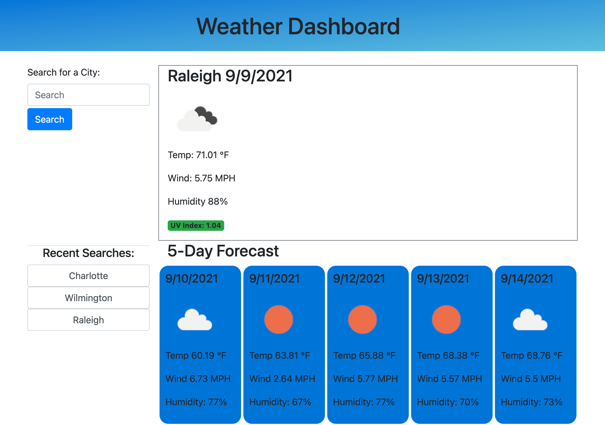

# Weather API
This application allows users to to check information about the weather, as well as a 5-day forecast.

## Technologies
`HTML/CSS` 
`Javascript` 
`Moment.js` 
`jQuery` 
`Bootstrap` 
`Open Weather Map API`

## Install
To install this application simply clone this repository, open it in your code editor and open the [`index.html`](index.html) in your browser.

## Usage 
To use this application users can enter a city they would like see the weather for. Then users can the search for their city and see the current weather conditions including wind, humidity, and UV index. Additionally, this application shows a five-day forecast. 

## Live Application 
[Here](https://spurgason.github.io/weather-api/)

## Contributor
[Shane Purgason](https://github.com/spurgason)

## Questions
[Github](https://github.com/spurgason)  
[Email](mailto:shanepurgason.98@gmail.com)

